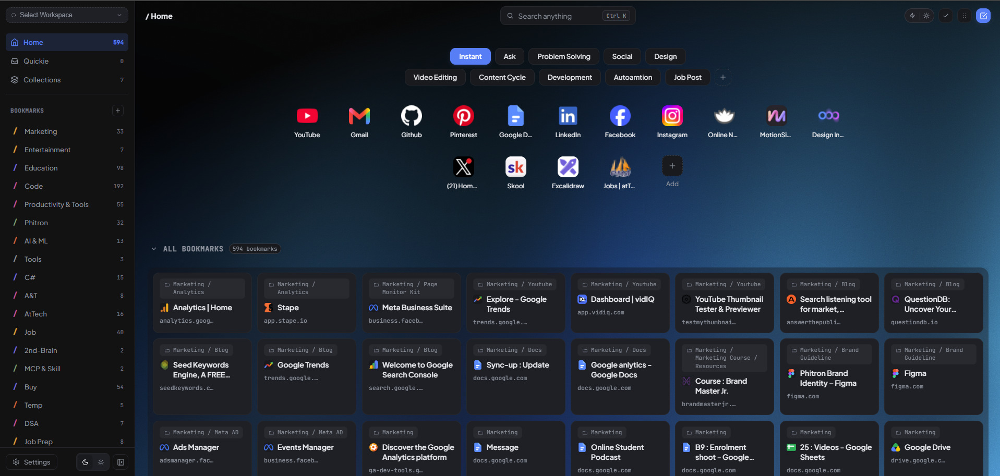
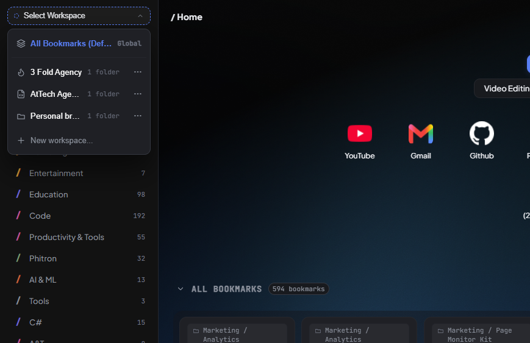
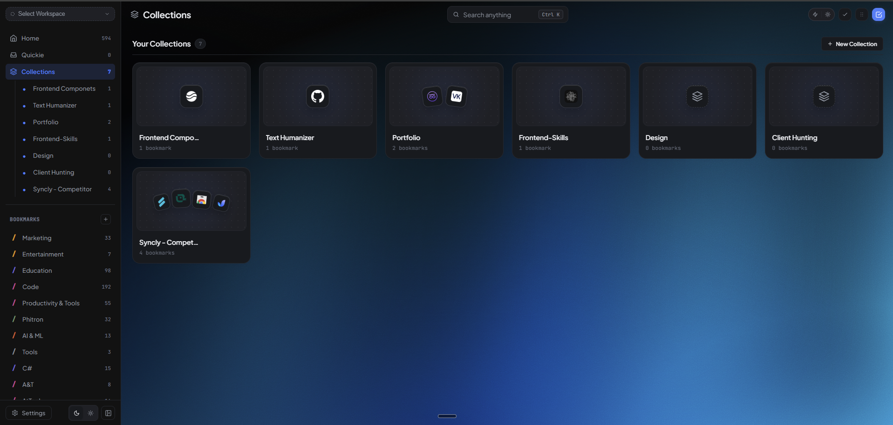
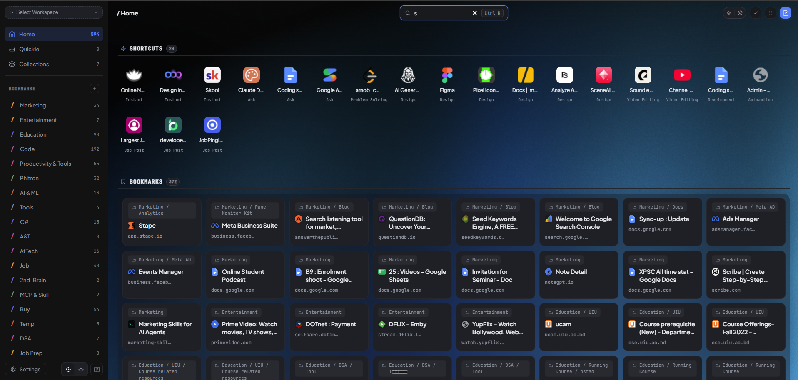
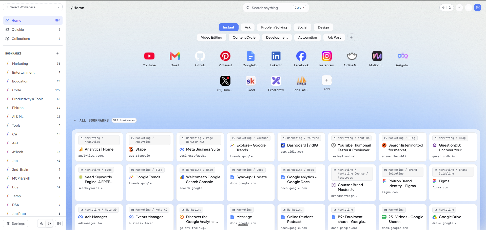
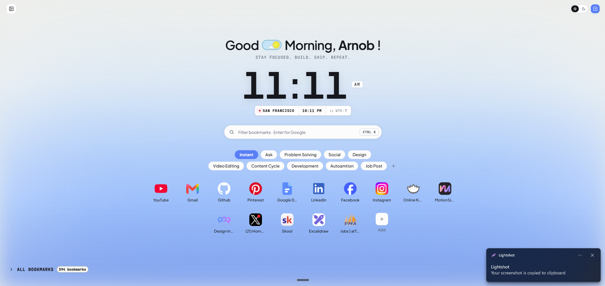
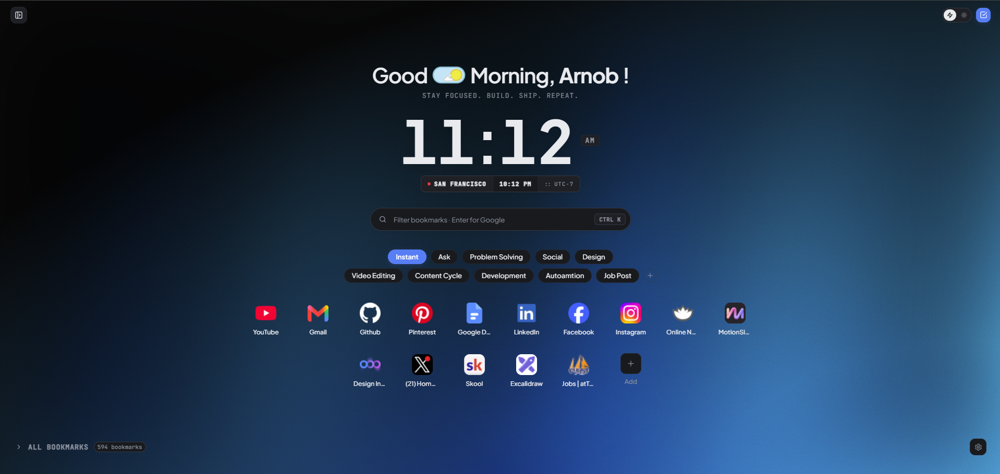

# Syncly

> A minimalist, privacy-first bookmark manager and new tab dashboard for Google Chrome.

[](LICENSE)
[](https://developer.chrome.com/docs/extensions/mv3/intro/)
[](.github/workflows/ci.yml)
[](#development--testing)
[](#architecture--design-principles)
[](CONTRIBUTING.md)

<p align="center">
  
</p>

---

## Overview

### The Problem
Browser bookmarks are essential tools for navigating the web, yet modern bookmark management is often cluttered, slow, or invasive:
- **Disorganized native managers**: Native browser bookmark managers lack contextual workspaces, collection bundling, tag filtering, and responsive visual organization.
- **Privacy-invasive cloud services**: Third-party bookmark services require creating external accounts, send browsing data to remote servers, and lock essential features behind paid subscriptions.
- **Bloated new-tab extensions**: Heavy new-tab replacements introduce multi-megabyte bundles, complex framework runtimes, and aggressive tracking that slows down tab opening speeds.

### The Solution
**Syncly** is built on a simple philosophy: **Sync everywhere, stay local.**

Syncly transforms your Chrome new tab page into a high-performance, two-pane workstation operating directly over your **native Chrome bookmarks**. It introduces contextual workspace profiles, cross-folder collections, instant fuzzy search, omnibox quick-actions, and multi-tier backups—all with **zero telemetry, zero external accounts, and zero build-step overhead**.

---

## Key Features & Visual Walkthrough

### 1. Contextual Workspaces
Group and scope your bookmark folders into dedicated contexts (*Work*, *Development*, *Design*, *Personal*) to eliminate visual noise. Dedicated workspace folders use the `w-` prefix convention under *Other Bookmarks* and sync natively through Chrome's built-in bookmark sync—guaranteeing quota-proof cross-device sync.

<p align="center">
  
</p>

### 2. Themed Collections & Bookmark Deck
Bundle related links into focused collections across different folder trees without restructuring your raw bookmarks. Enjoy clean, high-density card decks with rich metadata, auto-detected favicons, click tracking, and usage statistics.

<p align="center">
  
</p>

### 3. Instant Omni-Search & Tag Filtering
Hit `Ctrl+K` (or `Cmd+K`) from anywhere to launch instant, sub-millisecond fuzzy search across your entire bookmark library, collections, and custom tags (`#dev`, `#reading`, `#ai`). Search also supports direct omnibox integration (`nt <query>`) right from Chrome's URL bar.

<p align="center">
  
</p>

---

## Core Capabilities

- **Native Chrome Bookmarks Integration**: Directly syncs with Chrome's native bookmark tree (`chrome.bookmarks`) in real time. Changes made in the extension reflect in your browser, and vice versa.
- **Cross-Device Sync Engine**: Synchronizes workspaces, collections, and custom tags across devices via `chrome.storage.sync` and native bookmark transport with MV3 service-worker background reconciliation.
- **Omnibox Quick-Search**: Type `nt` followed by your query in the Chrome address bar to search and jump directly to any bookmark or workspace.
- **Quick-Add Toolbar Popup**: One-click action popup (`popup.html`) allowing you to save and tag the active tab into specific collections without opening a new tab.
- **Multi-Tier Backup System**:
  - *Automated Local Snapshots*: Periodic dirty-checked JSON file backups via the File System Access API and IndexedDB.
  - *Encrypted GitHub Gist Backup*: Optional, client-side encrypted cloud backup to a private GitHub Gist using your Personal Access Token (PAT).
- **AI Quota Tracking (Optional)**: Integrated quota derivation and rate-limit tracking for AI developers across major model providers.
- **Zero-Build Vanilla Architecture**: Pure modern JavaScript (ES modules) and native CSS tokens. No Webpack, Vite, Babel, or runtime bundle bloat.
- **Local-First Privacy**: All user data, tags, and workspace mappings are stored locally in `chrome.storage.local`. No external tracking, telemetry, or analytics.

---

## Themes & Display Modes

Syncly adapts to your setup with refined dark and light modes, alongside a zero-distraction Clean Mode for focused browsing.

### Standard Dashboard

| Light Appearance | Dark Appearance |
| :---: | :---: |
|  |  |

### Minimalist Clean Mode

| Clean Mode (Light) | Clean Mode (Dark) |
| :---: | :---: |
|  |  |

---

## Project Structure

```
Syncly/
├── src/                          # Extension source code (Vanilla ES Modules)
│   ├── presentation/             # UI Layer: NewTab, Popup, Options, Themes & Styles
│   │   ├── newTab/               # New tab dashboard views & controller
│   │   ├── popup/                # Quick-add toolbar popup
│   │   ├── options/              # Settings & backup management page
│   │   └── shared/               # DOM builder (el), SVG icons, theme engine, service worker
│   ├── application/              # Application Layer: Use cases, EventBus & ports
│   │   ├── useCases/             # Bookmarks, Workspaces, Collections, Tags, Sync
│   │   └── ports/                # Abstract repository and service contracts
│   ├── domain/                   # Domain Layer: Entities, Value Objects & pure services
│   │   ├── entities/             # Invariant-enforcing domain models
│   │   ├── valueObjects/         # Immutable value objects (Url, Greeting, Id)
│   │   └── services/             # In-memory OmniSearchIndex, workspace naming
│   └── infrastructure/           # Infrastructure Layer: Storage, Chrome APIs, Backup
│       ├── persistence/          # ChromeStorageClient & BaseChromeListRepository
│       ├── repositories/         # Concrete Bookmark, Collection, Tag & Group repos
│       ├── services/             # GoogleSync, GitHubBackup, AutoBackup, patCrypto
│       └── di/                   # Composition root (container.js)
├── test/                         # Comprehensive unit test suite (273 tests)
├── public/                       # Extension icons, fonts (Plus Jakarta Sans, JetBrains Mono), screenshots
├── scripts/                      # Performance benchmarking & smoke test harnesses
└── docs/                         # Architecture, Security, Permissions & Agent guidance
```

---

## Architecture & Design Principles

Syncly strictly adheres to **Clean Architecture** and **Domain-Driven Design (DDD)** principles with **Unidirectional Data Flow**:

```
┌─────────────────────────────────────────────────────────────┐
│                    Presentation Layer                       │
│  [NewTab Dashboard]      [Quick-Add Popup]    [Options UI]  │
└──────────────────────────────┬──────────────────────────────┘
                               │ invokes
┌──────────────────────────────▼──────────────────────────────┐
│                    Application Layer                        │
│   Use Cases: EnsureShortcuts, ListCollections, GoogleSync   │
└──────────────┬──────────────────────────────┬───────────────┘
               │ operates on                  │ depends on
┌──────────────▼──────────────┐┌──────────────▼───────────────┐
│        Domain Layer         ││     Infrastructure Layer     │
│ Entities & Value Objects    ││ ChromeStorage, IndexedDB, DI │
│   (Bookmark, Collection)    ││   (GoogleSync, GitHubBackup) │
└─────────────────────────────┘└──────────────────────────────┘
```

### Data Flow & Reactive State
1. **User Action**: The user interacts with the UI (e.g., adds a tag, creates a collection, clicks a workspace).
2. **Controller → Use Case**: Controller executes the respective application use case.
3. **Domain Mutation & Persistence**: The use case enforces business invariants and persists to `chrome.storage.local` / `chrome.bookmarks`.
4. **EventBus Emission**: An event is emitted across the centralized `EventBus` (e.g., `bookmarkGroups:changed`).
5. **Cross-Tab Synchronization**: `chrome.storage.onChanged` in `container.js` intercepts events and synchronizes all open Syncly tabs instantly.
6. **Reactive Re-render**: Subscribed controllers trigger DOM reconciliation via the secure `el()` helper.

---

## Installation

### Chrome Web Store
> **Status:** *Currently in active development / Pending Chrome Web Store publication.*

Once approved on the Chrome Web Store, the direct store installation link will be published here.

### Development Installation (Load Unpacked)

To run Syncly locally on any Chromium-based browser (Google Chrome, Brave, Microsoft Edge, Arc, Vivaldi):

1. **Clone the repository:**
   ```bash
   git clone https://github.com/KamrulIslamArnob/Syncly.git
   cd Syncly
   ```

2. **Open the Extensions page:**
   Navigate to `chrome://extensions` in your browser.

3. **Enable Developer Mode:**
   Toggle the **Developer mode** switch in the top-right corner.

4. **Load the extension:**
   Click the **Load unpacked** button and select the repository root directory.

5. **Open a new tab:**
   Open a new tab (`Ctrl + T` on Windows/Linux or `Cmd + T` on macOS) to launch Syncly.

---

## Development & Testing

Syncly is intentionally built with **zero runtime dependencies** and **no compilation build step**. Source code is directly interpreted by Chromium as native ES Modules.

### Prerequisites
- **Node.js:** Node 20.x or higher (required for executing tests).
- **Package Manager:** `npm` (bundled with Node.js).

### Commands

| Command | Purpose |
| :--- | :--- |
| `npm install` | Installs test devDependencies (`puppeteer-core`). |
| `npm test` | Runs the full automated unit test suite (273 tests via `node:test`). |
| `npm run perf` | Runs the automated performance baseline harness. |

### Development Workflow
- **Editing Views & Styles:** Edit files in `src/presentation/`. Refresh your new tab page to see changes immediately.
- **Editing Service Worker / Manifest:** Make changes to `manifest.json` or `src/presentation/shared/serviceWorker.js`, then click the reload icon on `chrome://extensions`.

---

## Permissions Justification

Syncly requests only the permissions strictly required to function as a bookmark manager:

| Permission | Justification |
| :--- | :--- |
| `bookmarks` | **Core functionality**: Enables reading, creating, editing, and syncing your bookmark tree. |
| `storage` | **Local state & sync**: Persists workspace layouts, custom tags, preferences, and cross-device sync metadata. |
| `unlimitedStorage` | **Reliability**: Ensures large bookmark libraries and tag indexes are not truncated by quota limits. |
| `activeTab` | **Quick-add popup**: Captures the current page title and URL when explicitly clicking the extension icon. |
| `tabs` | **Navigation**: Allows opening bookmarks in active or background tabs and querying current window state. |
| `favicon` | **Visual identification**: Fetches native cached website favicons via Chrome's secure favicon provider. |

---

## Security & Privacy

Syncly is engineered for maximum local-first privacy:
- **Zero Content Scripts**: Syncly injects no scripts into external websites you browse.
- **Strict Content Security Policy**: MV3 CSP (`script-src 'self'`) disallows remote code execution and disables `eval()`.
- **Safe Programmatic DOM**: All UI elements are generated via the secure `el()` builder using `textContent`, mitigating XSS risks.
- **URL Sanitization**: All bookmark links and imported URLs are strictly validated by `isSafeUrl()` against an allowlist of safe protocols (`http:`, `https:`).

For vulnerability disclosures and security policies, please review **[SECURITY.md](docs/security/SECURITY.md)**.

---

## Contributing

We welcome contributions of all kinds! Please read our **[Contributing Guidelines](CONTRIBUTING.md)** and **[Code of Conduct](CODE_OF_CONDUCT.md)** before submitting pull requests or opening issues.

---

## License

Syncly is open-source software licensed under the **[MIT License](LICENSE)**.

Copyright © 2026 [Kamrul Islam Arnob](https://github.com/KamrulIslamArnob).