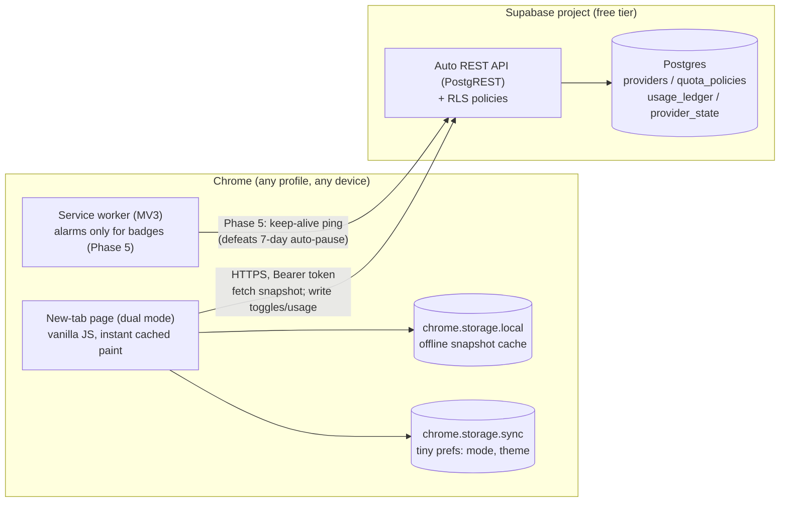

# AI Quota Tracker for a Dual-Mode Chrome New-Tab Extension

**Living build-task document — designed to be fed section-by-section into an AI code editor (Cursor, Claude Code, Copilot Workspace, etc.).**

- **Project codename:** `ai-quota-tracker`
- **Host extension:** your existing Chrome new-tab ("home tab") extension, which has **two modes**: the regular home tab and the **AI mode** this document specifies.
- **Hard constraint (from the owner):** the extension must stay **light**. Data must live in a **real database**, not only locally.
- **Document status:** v1.0 — researched and decision-complete. Every decision point lists alternatives and a recommendation, so you can override any choice before or during the build.

---

## Repository adaptation note (hybrid mode)

This document was originally written for a greenfield WXT + TypeScript extension. The host repository (NothingTab) is vanilla JS ES modules, strict Clean Architecture, no build system, no npm dependencies in production. Per owner decision **(hybrid resolution)**, the following overrides apply:

| # | Doc recommendation | NothingTab override |
|---|---|---|
| 3 | Vanilla TS or Preact | Vanilla JS + existing `el()` helper (`src/presentation/shared/dom.js`) |
| 5 | WXT (Vite/npm) | None — hand-edit existing `manifest.json` |
| 2 | Supabase JS SDK | Raw `fetch()` to PostgREST `/rest/v1/` with `apikey` + `Authorization: Bearer <PAT>` headers |
| — | "All data in chrome.storage.local" (CLAUDE.md) | Prefs in `chrome.storage.sync`, cache in `chrome.storage.local`, AI quota source-of-truth in Supabase Postgres. Provider API keys never leave backend. |

All other ADRs (architecture, schema, derived-state principle, security model, phased plan) apply unchanged.

---

## 1. TL;DR — The Decisions Up Front

Your two original questions were: **(1)** is this feature too heavy for the home tab, and **(2)** should it be a separate web application with an API the home tab merely views? The researched answer: the feature is **not heavy at all** — it is timestamps, booleans, and subtraction — and the correct split is a **thin extension client + a hosted database backend**, not a heavy extension and not a separate web app you must build first.

| # | Decision | Recommendation | Why (one line) |
|---|----------|----------------|----------------|
| 1 | Where the feature lives | **In the existing extension**, as a toggleable AI mode | The logic is trivial; weight comes from storage, which moves to the backend |
| 2 | Source of truth | **Hosted Postgres (Supabase free tier)** | Real database, auto-generated API, built-in auth, $0 at your scale [^25^][^27^] |
| 3 | Extension UI stack | **Vanilla JS (repo override of TS/Preact)** | New-tab pages must open instantly; frameworks are the #1 weight risk [^18^][^19^] |
| 4 | Auto-reactivation timers | **Derived state (lazy evaluation)**, no cron, no background jobs | Store `cooldown_until`; compute status on every read. Cannot drift, costs nothing |
| 5 | Management UI | **Phase 2:** Supabase dashboard → **Phase 6:** small optional web page | Don't build a dashboard before the extension works |
| 6 | Extension build tooling | **None (repo override of WXT)** | NothingTab is no-build vanilla JS; hand-edit manifest.json |
| 7 | Auth (v1, single user) | **Personal access token in `chrome.storage.local`** | Simplest safe option; upgrade path to OAuth documented in ADR-6 |

**If you change nothing in this document and build exactly what is recommended, you get:** a new-tab extension whose AI mode lists your AI providers (Claude Code, OpenAI-compatible APIs, etc.) with quota progress bars (per day / week / month / custom rolling windows), one-click active/inactive toggles, cooldown countdowns (e.g., "usable again in 2h") that flip back to active automatically, all persisted in a real Postgres database and synced across every Chrome profile you sign into.

---

## 2. Answers to Your Two Questions (Research-Backed)

### 2.1 "Is this heavy for the home tab?"

**No — and the reason matters, because it shapes the whole design.** Everything you described decomposes into three primitive operations: reading a small JSON payload, subtracting timestamps, and re-rendering a list. There is no continuous "processing" to speak of. A countdown timer is not a process; it is the expression `cooldown_until − Date.now()` evaluated each second while the tab is visible. Auto-reactivation is not a background job; it is the comparison `Date.now() >= cooldown_until` evaluated whenever state is read. Quota windows (daily, weekly, monthly, or Claude Code's rolling 5-hour sessions) are likewise just window boundaries computed from an anchor timestamp [^1^][^3^]. The client-side cost of this entire feature is a few kilobytes of JS and a sub-millisecond computation per card.

The **real** weight risk for a new-tab page is different, and Chrome's own documentation names it: override pages must be **"fast and small,"** must **never synchronously fetch network or database resources**, and should not block first paint on anything remote [^18^][^22^]. Users open dozens of tabs per hour; a 500ms blank flash on every new tab is what makes a home-tab extension feel "heavy," not business logic. Therefore the lightness budget is spent on **bundle size and render strategy** (Section 8.4), not on avoiding features: render instantly from a local cache, then refresh from the network asynchronously and patch the DOM. With that pattern, adding AI mode costs the user **zero** perceived load time.

### 2.2 "Web application + API endpoint, or build it in the extension?"

**Both instincts are partially right, and the synthesis is: put the data and auth in a hosted backend, put a thin viewer/controller in the extension, and defer the management UI.** Your requirement — "saved in a database, not locally, saved properly" — is the one thing the extension genuinely cannot do alone, and it is the decisive argument for a backend. `chrome.storage.sync` is capped at **100 KB total, 8 KB per item, 512 items**, with write-rate limits of ~120/minute [^2^][^5^]; `chrome.storage.local` gives you 10 MB on one machine only [^6^]. Neither gives you cross-device sync of real data, a queryable store, or a place to safely hold provider API keys. A hosted database solves all three.

But you do **not** need to build "a web application" first. A hosted Postgres with an auto-generated REST API (Supabase) or a small serverless API (Cloudflare Workers + D1) gives you the endpoint without a frontend project. The extension then does double duty: it is the viewer (new-tab AI mode) **and** its daily pings keep a free-tier Supabase project from being auto-paused after 7 days of inactivity [^25^][^27^] — a free-tier gotcha that your usage pattern conveniently neutralizes. A pretty web dashboard for managing providers becomes an optional Phase 6, not a prerequisite.

---

## 3. Product Specification

### 3.1 What the Feature Is (Decoded Requirements)

When the user toggles the new tab into **AI mode**, they see their registered **AI providers** as cards in a list. Each provider entry stores whatever is needed to identify and connect to it: provider kind (OpenAI-compatible, Anthropic-compatible, or other), base URL, API token (stored server-side only), and a list of models. Each provider can carry one or more **quota policies** — a budget measured over a period: *X tokens (or requests, or credits) per day / per week / per month / per custom rolling window*. Each provider is either **active** or **inactive**, and deactivating can optionally start a **cooldown timer** ("from now, 2 hours until I can use it again"); when the cooldown elapses, the provider **automatically reads as active again** — no user action, no server job.

The canonical example is Claude Code, whose real limits are a **rolling 5-hour session window** that opens with your first prompt, plus separate **weekly limits**; hitting either pauses usage until that window resets [^1^][^3^]. If you burn a session early, the wait until reset might be ~2 hours — exactly your "unclick it, set a timer, it comes back on its own" scenario. The data model below represents this natively as one **rolling-window quota** plus one **weekly quota** on the same provider.

### 3.2 User Stories

| ID | Story | Acceptance criteria |
|----|-------|---------------------|
| US-1 | As a user, I toggle between home mode and AI mode from the new tab | Toggle persists across sessions; last mode restored on next new tab; switch renders in < 100 ms |
| US-2 | As a user, I add a provider with kind, base URL, API token, and models | Provider appears in the list within one refresh; API token is **never** stored in the extension or `chrome.storage.sync` |
| US-3 | As a user, I attach quota policies: N tokens per day / week / month / custom hours | Progress bar shows `used / budget` and time-to-reset for each policy; supports rolling and calendar windows |
| US-4 | As a user, I click a provider card to toggle it active/inactive | One click flips state; visual state (pill + styling) updates instantly (optimistic UI) and syncs to the DB |
| US-5 | As a user, when I deactivate, I optionally set a cooldown (presets: 30m, 2h, 5h, custom) | Card enters "cooling down" state with live countdown; at `cooldown_until` it flips back to active **with no reload and no server job** |
| US-6 | As a user, I record usage against a policy (manual entry in v1; API import later) | Progress bar updates; when `used ≥ budget`, card shows "depleted" until window reset |
| US-7 | As a user, I open a new tab on a second Chrome profile/device | Same providers, states, and countdowns appear (backend is the source of truth) |
| US-8 | As a user, I open a new tab offline | Last cached snapshot renders instantly, visually marked as stale; no blank page, no spinner [^18^] |

### 3.3 Explicit Non-Goals for v1

- **No live metering of real API traffic.** v1 usage is manual or estimated; automatically pulling usage from provider APIs (where they even expose it) is a later enhancement.
- **No multi-user/team features.** Single user; the auth design leaves the door open (ADR-6).
- **No notifications in v1.** The state itself flips automatically; push/badge reminders are Phase 5 polish.
- **No web dashboard in v1.** Manage data via the extension's small edit form or the Supabase table editor; a dedicated dashboard is Phase 6.

---

## 4. The Core Design Principle: Derived State, Zero Processing

This is the single most important section for whoever (or whatever AI) builds this. **Every piece of dynamic behavior in this feature is derived from stored timestamps at read time.** Nothing ticks in the background; nothing needs a cron job, a serverless scheduled function, or a persistent service worker. This is what makes the feature cheap to run, trivial to keep consistent across devices, and impossible to "drift" out of sync.

The four derivations:

| Dynamic behavior | Stored data | Derivation (evaluated on every render/read) |
|---|---|---|
| Active vs. cooling-down | `cooldown_until` (timestamptz, nullable), `is_manually_paused` (bool) | `paused` if `is_manually_paused`; else `cooling` if `now < cooldown_until`; else `active` |
| Auto-reactivation | (same as above) | Nothing to do — once `now >= cooldown_until`, the derivation returns `active`. The UI just re-renders on its 1-second ticker |
| Quota window + time-to-reset | `window_type`, `window_hours`, `anchor` | Rolling: `[anchor, anchor + window_hours)`. Calendar: day/week/month boundaries in the user's timezone. `resets_at = window_end` |
| Depleted state | usage rows in current window | `used = SUM(amount) in window`; `depleted = used >= budget` |

Three consequences worth stating explicitly. **First**, an MV3 background service worker is evicted after ~30 seconds of inactivity and loses all in-memory state [^5^] — a design that depends on the worker "remembering" timers would be fragile; derived state survives because the truth lives in the database and the derivation is pure. **Second**, cross-device sync is free: two machines derive identical states from identical rows, with no sync protocol beyond "fetch fresh data." **Third**, server-side scheduled jobs (Supabase `pg_cron`, Cloudflare Cron Triggers — 5 on the free tier [^17^]) remain available later for *notifications*, but they must never be load-bearing for state. If you take one rule into the build: **state is computed, never mutated by time.**

---

## 5. Architecture Decision Records (Alternatives for Everything)

Each ADR lists every credible option, the trade-offs, and a **Recommendation** with reasoning. Override any of these before building — but write down what you changed and why, so the AI editor stays consistent.

### ADR-1: Where does the feature live?

| Option | What it means | Pros | Cons |
|---|---|---|---|
| **A. Inside the existing extension (recommended)** | AI mode is a view toggle in your current new-tab page | One install, one codebase; the feature's logic is provably light (Section 4) | Must respect the lightness budget (Section 8.4) |
| B. Separate second extension | A dedicated AI-mode extension overriding... nothing (a tab can't have two overrides — only one extension may override `newtab` [^22^]) | Clean separation | **Disqualified**: Chrome allows only one new-tab override per profile; you'd have to merge or give up your home tab |
| C. Web app only | A hosted page you open manually | No extension constraints | Loses the "it's on every new tab" value that motivated the feature |

**Recommendation: A.** Note the hard platform fact that decided this: Chrome grants exactly **one** page override per extension and effectively one new-tab override per browser profile [^22^][^24^], so a "second extension" cannot coexist with your home tab as a new-tab page. The dual-mode toggle inside one extension is the only architecture that preserves both.

### ADR-2: Client-side storage

| Option | Limits | Fits this project? |
|---|---|---|
| `chrome.storage.sync` | **100 KB total, 8 KB/item, 512 items, ~120 writes/min** [^2^][^5^] | Yes — for **tiny prefs only**: current mode (home/AI), theme, cached auth token reference. Syncs across devices for free |
| `chrome.storage.local` | 10 MB, this machine only [^6^] | Yes — as the **offline cache** of the last backend snapshot (enables instant paint, US-8) |
| IndexedDB | Large, local only | Overkill for a snapshot under ~50 KB |
| Backend only, no local storage | — | Violates the "never block first paint" rule [^18^]; keep the cache |

**Recommendation: sync for preferences + local for cache + Postgres for truth.** Never store provider API tokens in **any** extension storage — they live in the backend only (Section 9). Google's own guidance is to keep sensitive data out of `sync` [^5^]; we go further and keep secrets out of the extension entirely.

### ADR-3: Backend and database

This is the decision your "database, not locally" requirement hangs on. All four options are real; the table uses verified 2026 free-tier numbers.

| | **Supabase (recommended)** | Cloudflare Workers + D1 | Firebase (Spark) | Custom API (Node + tRPC + Postgres) |
|---|---|---|---|---|
| Type | Managed Postgres + auto REST API + auth + realtime | Serverless API + SQLite edge DB | NoSQL document DB + auth | Your code, your server |
| Free tier headline | 500 MB DB, 50k MAU, 5 GB egress, unlimited API requests [^25^][^27^] | 100k req/day, 5M rows read/day, 100k rows written/day, 5 GB [^12^][^15^][^17^] | 1 GB Firestore, 10 GB/mo egress, unlimited auth [^27^] | VPS cost (e.g., ~$5/mo) or free-with-cold-starts PaaS |
| You write | Almost nothing (PostgREST auto-API, RLS) | The whole API + auth layer [^12^] | Security rules + client SDK calls | Everything |
| Main catch | **Project auto-pauses after 7 days idle** [^25^][^27^] — mitigated here because your new tab pings it daily | 10 ms CPU cap per request on free tier; eventual consistency on replicas [^12^][^17^] | Per-operation billing surprises at scale; NoSQL model fits quotas poorly | Ops burden: hosting, TLS, backups, deploys |
| Data model fit | Excellent (SQL windows, views) | Good (SQLite; Drizzle ORM standard [^12^]) | Awkward (windowed sums need aggregation workarounds) | Excellent |

**Recommendation: Supabase.** For a single-user quota tracker, you get a real relational database ("saved properly"), an instant REST API, row-level security, and an upgrade path to realtime sync — at $0 within free-tier limits [^25^][^27^]. The 7-day pause rule is the usual dealbreaker, but your extension's daily usage keeps the project active naturally; add a keep-alive ping (Phase 5) as belt-and-braces. **Choose Workers + D1 instead** if you want zero pause risk and don't mind writing the API. **Choose the custom API** only if you already run a VPS and want everything self-owned — it directly answers your original "web application with an API endpoint" idea, at the highest maintenance cost.

### ADR-4: Extension UI rendering stack

| Option | Cost | Notes |
|---|---|---|
| **Vanilla JS (repo override; doc's TS/Preact collapsed to vanilla)** | ~0 KB runtime | This UI is a list of cards with a ticker; a framework buys little. Repo already ships `el()` DOM helper. |
| Preact | ~4 KB runtime | Fine middle ground if you want components/`useState`-style ergonomics |
| React | Large relative cost | A measured comparison showed a 2.3 MB bundle and 47ms render vs 0.3ms for vanilla on equivalent UI [^19^] — the wrong trade for a page that opens 100×/day |
| iframe to a hosted web app | 0 KB local, but... | New-tab page iframes your hosted app: instant updates without extension releases, **but** fails offline, adds frame latency, can't touch extension APIs, and the hosted page must permit framing. Keep as a fallback if you later build the Phase-6 dashboard |

**Recommendation: vanilla JS (repo override).** The lightness budget is spent on first paint, and nothing beats no runtime. Whatever you choose, MV3 forbids remotely hosted code — all JS must ship inside the extension package [^23^].

### ADR-5: Extension build tooling

| Option | Pros | Cons |
|---|---|---|
| **None (repo override; doc's WXT collapsed)** | Zero tooling; total transparency; preserves repo's no-build invariant | You manually maintain `manifest.json`, lose TS/HMR, copy files by hand |
| WXT | Vite-based, MV3-first manifest generation, TS, HMR dev loop, framework-agnostic, actively maintained | One more dependency to learn; conflicts with repo's no-npm constraint |
| Plasmo | Similar batteries, strong React integration | React-centric; heavier default setup than this project needs |
| Hand-rolled (plain files, no bundler) | Zero tooling; total transparency | You manually maintain `manifest.json`, lose TS/HMR, copy files by hand |

**Recommendation: none (repo override).** NothingTab's hard constraint is no build system, no npm. WXT is incompatible with that constraint. UI is tiny — hand-rolled manifest is the only viable choice.

### ADR-6: Authentication between extension and backend

| Option | Effort | Security | Fits v1? |
|---|---|---|---|
| **Personal access token (recommended for v1)** | Minutes: generate once, paste into extension options, store in `chrome.storage.local` | Good enough for single user over HTTPS; revocable | Yes |
| Supabase Auth (email/Google) via `chrome.identity.launchWebAuthFlow` | Half a day: OAuth dance, token refresh, RLS per user | Best; enables multi-user later | Phase 5+ |
| No auth (anonymous open endpoint) | Zero | **Unacceptable** — your quota data and especially provider keys must not be world-readable | Never |

**Recommendation: v1 = personal access token sent as a Bearer header, enforced by a thin RLS/policy layer. Design the schema with a `user_id` column from day one** so upgrading to real auth is a data migration, not a rewrite.

### ADR-7: Timer / auto-reactivation mechanism

| Option | How | Verdict |
|---|---|---|
| **Derived state (recommended)** | Section 4: compute from `cooldown_until` on every read; UI ticks `setInterval(1s)` only while the tab is visible | Primary mechanism. Free, exact, drift-proof, works offline against cache |
| `chrome.alarms` | MV3 alarms wake the worker to update a badge/notification | Coarse granularity (sub-minute precision not guaranteed); use **only** for optional badge reminders in Phase 5, never as the state mechanism |
| Server cron (pg_cron / CF Cron Trigger) | Scheduled job flips a stored `active` flag | **Rejected as the mechanism**: jobs fail, drift, and add infrastructure for something arithmetic already does. Acceptable later for notifications only (5 free CF Cron Triggers [^17^]) |

---

## 6. Recommended Architecture (What You Actually Build)



**Data flow on a new tab (the hot path, must stay under ~100 ms to first paint):**

1. HTML + tiny JS parse instantly; render skeleton **and** the cached snapshot from `chrome.storage.local` (stale-while-revalidate).
2. Async `fetch` the snapshot endpoint (`/rpc/v_provider_status` or three table selects) with the Bearer token.
3. On response: derive all states (Section 4), patch the DOM, write the fresh snapshot to `chrome.storage.local`.
4. While visible, a single 1-second `setInterval` re-renders countdown texts only. Clear it on `visibilitychange`.

**Writes** (toggle active, set cooldown, add usage) are optimistic: patch UI immediately, POST to the API, roll back and toast on failure.

**Why this is light, in numbers:** target bundle ≤ 150 KB total (vanilla JS makes this easy); first paint from cache with **zero** network dependency on the critical path, per Chrome's override-page guidance [^18^]; one HTTP request per new tab (debounced to at most one per 30 seconds across rapid tab openings); no persistent connections, no background worker work in v1.

---

## 7. Database Schema (Postgres / Supabase)

Four tables plus one derived view. Exact DDL lives in `supabase/schema.sql`; preset seeds in `supabase/seed.sql`. Summary:

```sql
-- Who you are (v1: single row; column exists from day one for ADR-6 upgrade)
providers (
  id            uuid primary key,
  user_id       uuid not null,              -- future-proofing for real auth
  name          text not null,              -- "Claude Code", "OpenRouter", "My LiteLLM"
  kind          text not null,              -- 'anthropic_compatible' | 'openai_compatible' | 'other'
  base_url      text,                       -- e.g. https://api.anthropic.com
  api_key       text,                       -- SERVER-SIDE ONLY, never selected by the extension API (Section 9)
  models        jsonb default '[]',         -- ["claude-sonnet-4-6", "claude-opus-4-6"]
  notes         text,
  sort_order    int default 0
);

-- Budgets: "this many tokens per day/week/month/custom rolling window"
quota_policies (
  id            uuid primary key,
  provider_id   uuid references providers on delete cascade,
  label         text not null,              -- "Session window", "Weekly cap", "Monthly API budget"
  metric        text not null default 'tokens',   -- 'tokens' | 'requests' | 'credits' | 'usd'
  budget        numeric not null,           -- e.g. 45 (prompts), 1_000_000 (tokens), 20 (USD)
  window_type   text not null,              -- 'rolling_hours' | 'calendar_day' | 'calendar_week' | 'calendar_month'
  window_hours  int,                        -- for rolling_hours: 5 for a Claude Code session [^1^][^3^]
  anchor        timestamptz,                -- rolling: when current window opened (first use); null = not started
  timezone      text default 'UTC'          -- calendar windows anchor to this tz
);

-- Mutable state (kept separate so quota history stays clean)
provider_state (
  provider_id        uuid primary key references providers on delete cascade,
  is_manually_paused boolean not null default false,   -- user "unclicked" with no timer
  cooldown_until     timestamptz,                       -- user "unclicked" with a timer (e.g. now + 2h)
  updated_at         timestamptz not null default now()
);

-- Every recorded consumption event (manual in v1; API-imported later)
usage_ledger (
  id            uuid primary key,
  policy_id     uuid references quota_policies on delete cascade,
  amount        numeric not null,
  source        text not null default 'manual',   -- 'manual' | 'api' | 'estimate'
  note          text,
  recorded_at   timestamptz not null default now()
);
```

**The derived view is where Section 4 becomes code.** The extension (and any future dashboard) reads *this*, never raw tables:

```sql
-- v_provider_status: one row per provider with everything the UI needs
--   effective_state:  'active' | 'cooling' | 'paused' | 'depleted'
--   per policy:       used, remaining, window_start, window_end, seconds_to_reset
--   cooling:          seconds_until_active = cooldown_until - now()
-- Derivation rules (implement exactly):
--   paused   := is_manually_paused
--   cooling  := NOT paused AND cooldown_until > now()
--   depleted := NOT paused AND NOT cooling AND any policy has used >= budget
--   active   := everything else
```

**Preset seeds (ship these as example rows so the feature is self-explanatory):** "Claude Code — Session" = `rolling_hours`, `window_hours = 5`, metric `requests`; "Claude Code — Weekly" = `calendar_week`; matching the real dual-limit structure of a rolling 5-hour window plus weekly caps [^1^][^3^]. "OpenAI-compatible — Monthly budget" = `calendar_month`, metric `usd`.

---

## 8. Extension Specification

### 8.1 API Contract (Extension ↔ Backend)

With Supabase, PostgREST generates CRUD for free; the extension mostly needs **one read** and **three writes**:

| Operation | Method & path | Body | Notes |
|---|---|---|---|
| Snapshot (the hot path) | `GET /rest/v1/v_provider_status` | — | Called once per new tab, debounced 30 s; response typically < 20 KB. View excludes `api_key`. |
| Toggle / cooldown | `PATCH /rest/v1/provider_state?provider_id=eq.{id}` | `{is_manually_paused, cooldown_until}` | Optimistic UI; rollback on error |
| Record usage | `POST /rest/v1/usage_ledger` | `{policy_id, amount, note}` | v1 manual entry. Trigger advances rolling anchor. |
| Provider CRUD | `POST/PATCH/DELETE /rest/v1/providers`, `/quota_policies` | row JSON | v1: small edit form in extension, or Supabase table editor |

All requests carry `apikey` + `Authorization: Bearer <token>` headers. **Select lists must never include `api_key`** — see Section 9. The `v_provider_status` view enforces this at the schema level (column not selected).

### 8.2 File Structure (NothingTab adaptation)

NothingTab is vanilla JS + Clean Architecture. Files map onto existing layer conventions, not WXT's `entrypoints/` layout:

```
src/domain/
  entities/
    AiProvider.js
    QuotaPolicy.js
    ProviderState.js
    UsageEntry.js
  valueObjects/
    AppMode.js          # 'home' | 'ai'
    QuotaWindow.js      # window_type + window_hours + anchor + tz
    ProviderKind.js
    QuotaMetric.js
  services/
    quotaDerivation.js  # Section 4 pure functions, unit-testable
  repositories/
    repositories.js     # add: AiQuotaRepository, ModeRepository interfaces

src/application/
  ports/
    ports.js            # add: BackendClient (driven interface for fetch)
  useCases/
    mode/
      GetModeUseCase.js
      SetModeUseCase.js
    aiQuota/
      GetSnapshotUseCase.js
      ToggleProviderUseCase.js
      SetCooldownUseCase.js
      RecordUsageUseCase.js
      ReactivateProviderUseCase.js

src/infrastructure/
  services/
    SupabaseClient.js            # raw fetch, Bearer + apikey, 30s debounce
    SupabaseAiQuotaRepository.js # implements AiQuotaRepository
  persistence/
    chromeStorage/
      ChromeSyncStorageClient.js # NEW: wraps chrome.storage.sync (prefs)
      ChromeModeRepository.js    # prefs: home/ai mode
      ChromeAiQuotaCacheRepository.js  # local snapshot cache
  di/
    container.js        # wire new repos + use cases here

src/presentation/
  newTab/
    views/
      ModeToggleView.js     # home ⇄ AI switch, persisted to storage.sync
      AiQuotaView.js        # provider card list
      CooldownMenuView.js   # presets: 30m / 2h / 5h / custom / "until reset"
      UsagePopoverView.js   # quick "+ record usage" form
  shared/
    ticker.js               # 1s interval, visibility-aware
  options/
    optionsController.js    # add: token entry, backend URL, cooldown presets

manifest.json              # add: host_permissions for supabase.co

test/
  ai-quota-derive.test.mjs  # unit tests for quotaDerivation.js (pure fns)

supabase/
  schema.sql                # tables + view + functions + RLS + trigger
  seed.sql                  # seed_default_providers() RPC

scripts/
  smoke-ai-quota-backend.mjs # node fetch smoke test (named `smoke-*` so `node --test` skips it)
```

### 8.3 UI States per Provider Card

| State | Pill | Bar | Countdown text | Trigger |
|---|---|---|---|---|
| **active** | green "Active" | used/budget | "resets in 3h 12m" (per policy) | default |
| **cooling** | amber "Cooling down" | frozen | **"usable again in 1h 58m"** | user deactivated with timer |
| **paused** | gray "Paused" | frozen | "until you reactivate" | user deactivated, no timer |
| **depleted** | red "Depleted" | full | "quota resets in 2d 4h" | `used ≥ budget` in current window |
| **stale** | dimmed + "offline" badge | cached values | cached values | fetch failed / offline |

Click behavior (US-4/US-5): clicking an **active** card opens the deactivate menu → *Pause* (no timer) or *Cooldown…* (preset or custom duration → sets `cooldown_until = now + d`). Clicking a **paused/cooling** card reactivates immediately (`is_manually_paused=false`, `cooldown_until=null`). A cooling card reaching zero flips to active on the next ticker tick — automatically, everywhere, because every client derives from the same timestamp.

### 8.4 Lightness Budget (Enforce in Code Review / AI Prompts)

| Rule | Target | Rationale |
|---|---|---|
| Total JS shipped | ≤ 150 KB minified | Frameworks are the main threat [^19^] |
| First contentful paint | ≤ 100 ms from cache, network-independent | Chrome: override pages must be fast, never synchronously fetch [^18^] |
| Network per new tab | 1 request, ≤ 50 KB, debounced 30 s | Snapshot only |
| Background worker work | Zero in v1 | MV3 workers die ~30 s idle anyway [^5^]; derived state needs no worker |
| DOM nodes in AI mode | ≤ ~300 (≈20 providers × 15 nodes) | Ticker updates text nodes only, never rebuilds the list |
| Permissions | `storage` only in v1 (+`alarms` in Ph5) | Every permission is review friction and user distrust |

---

## 9. Security Model

Three rules, non-negotiable. **(1) Provider API keys never leave the backend.** The extension's select lists exclude `api_key`; if the extension never reads it, it can never leak it. v1 doesn't route actual LLM calls, so the key is stored purely as your record — encrypt at rest (Supabase Vault or pgcrypto) if you want defense in depth. **(2) Nothing sensitive in `chrome.storage.sync`.** Google warns sync data replicates through their servers [^5^]; we store only mode/theme there, and the bearer token in `storage.local`. **(3) RLS on every table**, policies keyed to `user_id`, even in single-user v1 — the day you switch on real auth (ADR-6), nothing about the schema changes. Additional hygiene: HTTPS only; revoke/rotate the bearer token from the options page; CSP in the new-tab page locked to `self` (MV3 forbids remote code regardless [^23^]).

---

## 10. Phased Build Plan (Feed These to the AI Editor One at a Time)

Each phase is self-contained, shippable, and sized for one focused AI-editor session. Do not start a phase until the previous phase's acceptance criteria pass.

### Phase 0 — Backend scaffold (~1 session)

- Create Supabase project; apply `supabase/schema.sql` (tables + view + functions + RLS + trigger).
- Run `supabase/seed.sql` → then call `SELECT seed_default_providers()` after first sign-in.
- Create a personal access token / API key for the extension (ADR-6).
- **Acceptance:** `node scripts/smoke-ai-quota-backend.mjs` (with env vars set) returns all-green: unauthenticated read rejected, authenticated read returns seeded data, `api_key` never appears in any response.

### Phase 1 — Extension skeleton + dual mode (~1 session)

- Add `ModeRepository` interface + `ChromeModeRepository` (uses `chrome.storage.sync`).
- Add `ChromeSyncStorageClient` (new — current `ChromeStorageClient` is hardcoded to `.local`).
- `GetModeUseCase`, `SetModeUseCase`, `ModeToggleView` (uses `el()` helper).
- Wire in `container.js`; extend `storage.onChanged` listener to also handle `area === "sync"`.
- **Acceptance:** new tab opens to last-used mode in ≤ 100 ms with the network cable unplugged; toggle flips instantly; zero console errors.

### Phase 2 — Read path (~1 session)

- `src/domain/services/quotaDerivation.js` (pure fns) + `test/ai-quota-derive.test.mjs`.
- `src/domain/entities/{AiProvider,QuotaPolicy,ProviderState,UsageEntry}.js` with `#` fields + `toJSON` / `fromJSON` (mirror `Task.js` pattern).
- `src/application/ports/ports.js` → add `BackendClient` port.
- `src/infrastructure/services/SupabaseClient.js` (raw `fetch`, Bearer + apikey, 30s debounce).
- `src/infrastructure/services/SupabaseAiQuotaRepository.js`.
- `src/infrastructure/persistence/chromeStorage/ChromeAiQuotaCacheRepository.js`.
- `src/presentation/newTab/views/AiQuotaView.js` (cards from snapshot; stale-while-revalidate).
- **Acceptance:** with backend seeded, a new tab paints cached data instantly and patches fresh data in; killing Wi-Fi keeps the page fully rendered with the stale badge (US-8).

### Phase 3 — Write path: toggles, cooldowns, usage (~1–2 sessions)

- `ToggleProviderUseCase`, `SetCooldownUseCase`, `RecordUsageUseCase`, `ReactivateProviderUseCase`.
- `src/presentation/newTab/views/CooldownMenuView.js` (presets 30m/2h/5h/custom).
- `src/presentation/newTab/views/UsagePopoverView.js`.
- `src/presentation/shared/ticker.js` (1s interval, visibility-aware).
- Optimistic PATCH with rollback; ticker-driven countdowns; usage popover posting to `usage_ledger`; progress bars + "resets in …".
- **Acceptance (the money test):** deactivate a provider with a 2-minute cooldown → card counts down live → flips to active by itself. Open a second browser profile → same state, same countdown (US-5, US-7). Set usage ≥ budget → "depleted" until window end (US-6).

### Phase 4 — Provider/policy editing (~1 session)

- Minimal in-extension form (or a deliberate decision to use the Supabase table editor and skip to Phase 5).
- `api_key` field write-only, never re-rendered (Section 9). Column-level grant in `schema.sql` already enforces no-read.
- **Acceptance:** create/edit/delete providers and policies end-to-end from the extension.

### Phase 5 — Polish (~1 session, optional)

- Preset templates ("Claude Code: 5h rolling session + weekly cap" [^1^][^3^]); `chrome.alarms`-based badge dot when something finishes cooling; daily keep-alive ping so the free-tier project never hits the 7-day auto-pause [^25^][^27^]; drag-to-reorder cards.

### Phase 6 — Optional web dashboard (later)

- A small hosted page (any static host + Supabase JS) for comfortable management on a big screen. Only now does your original "web application" idea become worth its cost — and it can reuse the same view, API, and auth untouched. The extension can even iframe it as an alternative management surface (ADR-4, option 4).

---

## 11. Master Prompt (Paste Into Your AI Code Editor)

> You are building **ai-quota-tracker**, an "AI mode" for my existing Manifest V3 Chrome new-tab extension (NothingTab). The full spec is in `AI-Quota-Tracker-Extension-Build-Task.md` — read it before writing any code and follow its ADRs exactly. Note the "Repository adaptation note" at the top: this repo is **no-build vanilla JS + Clean Architecture** — do NOT add WXT, npm deps, TypeScript, or Preact. Use the existing `el()` DOM helper, the existing `BaseChromeListRepository` pattern, and wire all new use cases in `src/infrastructure/di/container.js`.
>
> Non-negotiables: (1) The extension stays light — vanilla JS, total JS ≤ 150 KB, first paint from `chrome.storage.local` cache with no network on the critical path. (2) All state is **derived from timestamps at read time** — no cron jobs, no background timers mutating state; implement `src/domain/services/quotaDerivation.js` as pure functions with unit tests. (3) The source of truth is Supabase Postgres per the Section 7 schema; provider API keys are server-side only and never selected by the extension (enforced by `v_provider_status` view + column-level REVOKE on `api_key`). (4) UI has five card states — active / cooling / paused / depleted / stale — exactly as specified in §8.3.
>
> We work phase by phase (Section 10). Start with **Phase N**: <paste the phase text>. Show me the plan first, then implement, then give me the exact steps to verify each acceptance criterion.

Workflow tips: keep the task doc in the repo root (AI editors index it automatically); after each phase, ask the AI to update the doc's status line; when an ADR is overridden, record the change in the doc before prompting further.

---

## 12. Testing & Launch Checklist

- [ ] New tab paints ≤ 100 ms with network throttled to offline (the lightness exam)
- [ ] Bundle report: total JS ≤ 150 KB; no remote code anywhere (MV3 forbids it [^23^])
- [ ] Cooldown round-trip: set 2 min → countdown → auto-active, verified in two Chrome profiles
- [ ] Rolling window math: 5h window opens on first usage entry, `resets_at` = anchor + 5h [^1^]
- [ ] Calendar windows: day/week/month boundaries land on the configured timezone, incl. DST week
- [ ] `api_key` never appears in any network response reachable by the extension
- [ ] Token revoked → extension shows a clean "re-authenticate" state, not a crash
- [ ] Supabase dashboard shows project active (keep-alive ping working) after 7+ days [^25^]
- [ ] `chrome.storage.sync` holds < 1 KB (mode + theme only); quota data is provably in Postgres, not locally — your original hard requirement

---

## 13. Quick Reference: Verified Platform Numbers

| Fact | Value | Source |
|---|---|---|
| `chrome.storage.sync` caps | 100 KB total / 8 KB per item / 512 items / ~120 writes per min | [^2^][^5^] |
| `chrome.storage.local` cap | 10 MB (more with `unlimitedStorage`) | [^2^][^6^] |
| MV3 service worker lifetime | evicted after ~30 s idle; no in-memory state survives | [^5^] |
| New-tab override rule | one page override per extension; must be "fast and small," no sync network fetches | [^18^][^22^] |
| Claude Code limit structure | rolling 5-hour session window + weekly limits (doubled May 6, 2026) | [^1^][^3^] |
| Supabase free tier | 500 MB Postgres, 50k MAU, unlimited API requests; auto-pause after 7 idle days | [^25^][^27^] |
| Cloudflare Workers/D1 free tier | 100k req/day; D1 5M reads/day, 100k writes/day, 5 GB | [^12^][^15^][^17^] |
| Firebase Spark free tier | 1 GB Firestore, 10 GB/mo egress, unlimited auth, no auto-pause | [^27^] |
| MV3 remote code | prohibited — all JS must ship in the package | [^23^] |

---

*Document ends. Update the status line in the header as phases complete.*

[^1^]: https://www.morphllm.com/claude-code-usage-limits
[^2^]: https://developer.chrome.com/docs/extensions/reference/api/storage
[^3^]: https://www.truefoundry.com/blog/claude-code-limits-explained
[^5^]: https://mv3-extension.com/core-apis-cross-browser-data-management/chrome-storage-api-sync/
[^6^]: http://extensions.neplox.security/Basics/Storage/
[^12^]: https://www.buildmvpfast.com/blog/cloudflare-workers-hono-d1-r2-free-fullstack-2026
[^15^]: https://developers.cloudflare.com/d1/platform/pricing/
[^17^]: https://developers.cloudflare.com/workers/platform/limits/
[^18^]: http://www.kkh86.com/it/chrome-extension-doc/extensions/override.html
[^19^]: https://levelup.gitconnected.com/why-i-stopped-using-react-and-switched-to-vanilla-javascript-5e0b553ae195
[^22^]: https://developer.chrome.com/docs/extensions/develop/ui/override-chrome-pages
[^23^]: https://en.wikipedia.org/wiki/Google_Chrome
[^24^]: https://developer.chrome.com/docs/extensions/mv2/override
[^25^]: https://makerkit.dev/blog/saas/supabase-pricing
[^27^]: https://aiagencyplus.com/supabase-free-tier-limits/
